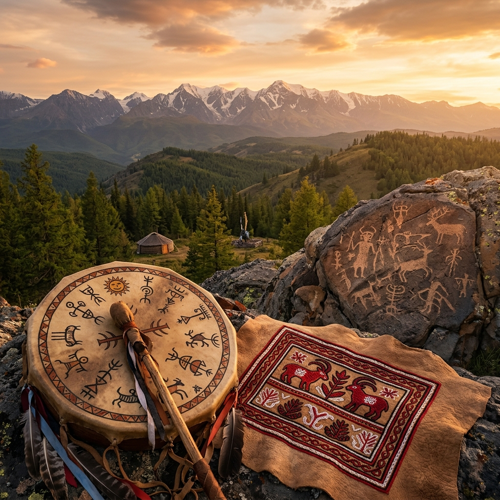

# 🏺 Teleut-Heritage-Core

## 📜 Vizyon
Teleut-Heritage-Core, Sibirya'nın yerli Türk halklarından biri olan **Teleut halkına** adanmış kapsamlı bir araştırma ve dijital dokümantasyon merkezidir. Bu proje; Teleutların kadim geleneklerini, tehlike altındaki dillerini ve zengin etnografik mirasını bilimsel bir metodoloji ile dijital dünyaya taşımayı hedefler.

## 🌍 Etno-Tarihsel Arka Plan
Teleutlar (kendilerini *Telenget* veya *Telengut* olarak adlandırırlar), tarih boyunca "Beyaz Kalmuklar" olarak anılmış, Altay-Sayan bölgesinin en eski Türk sakinlerindendir. 
- **Nüfus ve Coğrafya:** Günümüzde yaklaşık 2.500 - 3.000 kişilik bir nüfusa sahip olan Teleutlar, ağırlıklı olarak Rusya'nın Kemerovo Oblastı (Kuzbass) ve Altay Cumhuriyeti'nde yaşamaktadırlar.
- **Tarihsel Köken:** Kökenleri antik Tiele (Tele) boylarına ve Yenisey Kırgızlarına kadar uzanmaktadır. 17. yüzyılda Cungar Hanlığı ve Rus Çarlığı arasındaki jeopolitik dengelerde kritik bir rol oynamışlardır.

## 🗂 Depo Yapısı ve Detaylı Analizler

### 01_Ontoloji_ve_Kozmoloji (Dünya Görüşü ve Sosyal Yapı)
Teleut toplumunun temeli **Seok** adı verilen baba soylu klan sistemine dayanır.
- **Seok Sistemi:** Mundus, Merkit, Tumat, Koyat, Oçy ve Çagat gibi klanlar Teleut kimliğinin çekirdeğini oluşturur. Bu sistem, evliliklerden kaynak yönetimine kadar tüm sosyal hayatı düzenler.
- **Manevi Miras:** Geleneksel Şamanizm (Kamlık) inancı, ruhlarla kurulan iletişim ve doğa kültleri üzerine kuruludur. Ayrıca Burhancılık ve Ortodoks Hıristiyanlığın senkretik etkileri görülmektedir.
- **Kut ve Ruh Kavramı:** Yaşam gücü (Kut) ve insanın doğayla olan ontolojik bağı bu modülün ana araştırma konusudur.

### 02_Dil_ve_Filoloji (Teleut Lehçesi)
Teleutça, Güney Altay dilleri grubuna ait olup UNESCO tarafından "kesinlikle tehlike altında" (definitely endangered) olarak sınıflandırılmaktadır.
- **Dilsel Özellikler:** Güçlü vokal uyumu, arkaik Türk kelime hazinesi ve kendine has fonetik değişimler.
- **Sözlü Gelenek:** "Kay" adı verilen boğaz havası anlatıcılığı, Teleut mitolojisinin ve kahramanlık destanlarının nesilden nesile aktarılmasını sağlar.
- **Dokümantasyon:** Bu modül, dijital bir sözlük çekirdeği ve gramer analizleri içerir.

### 03_Tarih_ve_Etnogenez (Kökler ve Göçler)
Teleutların tarihsel yolculuğu, Orta Asya bozkırlarından Sibirya ormanlarına kadar geniş bir alanı kapsar.
- **Beyaz Kalmuklar Dönemi:** 17. ve 18. yüzyıllarda Teleut beylerinin diplomatik faaliyetleri.
- **Bachat Teleutları:** Kuzey bölgelere yerleşen ve madencilik/tarım ile uğraşan alt grupların tarihçesi.

### 04_Etnografya_ve_Sanat (Maddi Kültür)
- **Geleneksel Kostüm:** Teleut kadınlarının renkli nakışlarla süslü elbiseleri ve özgün başlıkları.
- **Mutfak:** "Peremyachi", "Tutmaç" ve avcılığa dayalı geleneksel Teleut yemekleri.
- **Zanaat:** Deri işleme, ahşap oymacılığı ve metal işçiliği.

### 05_Dijital_Miras_Yonetimi (Teknik Çekirdek)
- **Envanter:** Kültürel artefaktların yüksek çözünürlüklü dijital kopyaları.
- **Arşivleme:** Verilerin ontolojik olarak etiketlenmesi ve uzun vadeli korunması için geliştirilen teknik protokoller.

## 🚀 Başlangıç
Bu depo, araştırmacılar ve Teleut mirasına ilgi duyanlar için bir açık kaynak bilgi tabanıdır. Modüllere erişmek için ilgili dizinlere gidin.

## 🤝 Katkı Sağlama
Teleut kültürü üzerine çalışan akademisyenler, dilbilimciler ve saha araştırmacıları; yeni veriler ve analizler ekleyerek bu çekirdeği büyütebilirler. Katkılar için `05_Dijital_Miras_Yonetimi` altındaki rehberi takip ediniz.
